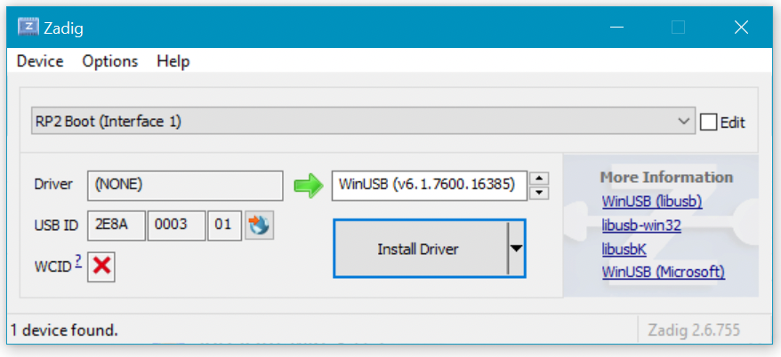
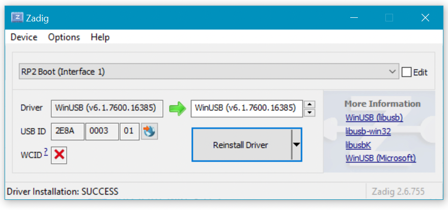

# Windows Specific Instructions

## WinUSB driver

In order to flash the board using WebUSB on Windows the WinUSB driver mush be installed.

1. Download [Zadig](https://github.com/pbatard/libwdi/releases/download/b755/zadig-2.6.exe)
1. Put board into USB boot ROM mode, by holding down Boot or BOOTSEL button while plugging in USB cable.
1. Open Zadig
1. In drop-down, ensure "RP2 Boot (Interface 1)" is selected:

1. Click "Install Driver" button.
1. WinUSB driver is installed

